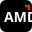

# ⚡ AMD LLM Lab

<p align="center">
  
</p>

<h3 align="center">Understand LLM Inference Performance Before You Run The Model.</h3>

<p align="center">
  <strong>An open-source research platform, physics-based memory calculator, model advisor, and community benchmark hub for AMD Instinct™ MI300X, Radeon™ GPUs, and hardware optimization.</strong>
</p>

<p align="center">
  <a href="https://amd-llm-lab.vercel.app/"></a>
  <a href="https://vedantjadhav.hashnode.dev/amd-llm-lab"></a>
  <a href="https://github.com/VedantJadhav701/AMD_LLM_LAB"></a>
  <a href="https://nextjs.org/"></a>
  <a href="https://fastapi.tiangolo.com/"></a>
  <a href="https://rocm.docs.amd.com/"></a>
  <a href="LICENSE"></a>
</p>

<p align="center">
  <a href="https://amd-llm-lab.vercel.app/"><strong>🌐 Live Demo</strong></a> &nbsp;|&nbsp;
  <a href="https://vedantjadhav.hashnode.dev/amd-llm-lab"><strong>📝 Technical Breakdown</strong></a> &nbsp;|&nbsp;
  <a href="https://github.com/VedantJadhav701/AMD_LLM_LAB"><strong>💻 GitHub Repository</strong></a>
</p>

---

## 🌟 Overview

**AMD LLM Lab** is an open-source, independent research project designed to help AI developers, machine learning engineers, and system architects optimize Large Language Model (LLM) inference.

Model parameter size is only the beginning—**precision (FP16, INT8, INT4), context length, batch size, and inference backend (`vLLM`, `TGI`, `TRT-LLM`)** completely shift the operating envelope. 

AMD LLM Lab answers critical infrastructure questions before executing costly runs:
- 💡 *"I have a 4GB, 8GB, 24GB, or 192GB GPU. Which model and quantization precision should I run?"*
- 📐 *"Will a 70B parameter model at 16,384 context tokens fit inside my VRAM budget?"*
- 📊 *"What generation speed (tokens/sec) and peak memory footprint can I expect on AMD Instinct MI300X or Radeon GPUs?"*

---

## ✨ Key Features

### 🔮 1. Model Advisor (*"What Should I Run?"*)
Input your GPU VRAM size (from 4GB consumer cards to 192GB+ accelerators), memory bandwidth, and primary goal:
- **Run the Biggest Model**: Maximizes parameter count while keeping VRAM footprint within safety thresholds.
- **Fastest Decode Throughput**: Prioritizes high generation tokens/second using bandwidth roofline models and measured community benchmarks.
- **Maximum Context Window**: Optimizes KV-cache allocation for long-context applications (up to 131k tokens).

### 📐 2. Memory Fit Calculator (*"Will It Fit?"*)
An analytic physics engine that calculates exact memory requirements for any Hugging Face model repository or custom model spec:
$$\text{Total VRAM} = \text{Weights GB} + \text{KV Cache GB} + \text{Runtime Overhead GB}$$
- Calculates weight size across **BF16, FP16, INT8, INT4, and INT2** precisions.
- Dynamically scales runtime allocator overhead (`0.4 GB` for 4GB GPUs up to `2.5 GB` for enterprise accelerators).
- Evaluates maximum sequence context ceiling and memory bandwidth roofs.

### 🏆 3. Community Benchmark Hub & Leaderboard
- A public, open benchmark repository ranking real LLM runs from AMD GPUs.
- Measures memory in three distinct phases: **load peak VRAM**, **steady-state VRAM**, and **run peak VRAM**.
- Includes the `rocm_bench.py` CLI tool so anyone running an AMD GPU can measure and submit performance runs.

### 📊 4. Empirical MI300X Benchmark Dataset
- 57+ direct observations on **AMD Instinct MI300X (192 GB HBM3)**.
- Covers parameter sizes from 0.5B to 70B+, context lengths up to 32,768 tokens, and multiple inference stacks.
- Retains full provenance: observations are explicitly labeled `MEASURED`, while machine learning regressors provide `ESTIMATED` predictions with held-out MAE error metrics.

### 💻 5. Local System Hardware Probe
- Automatically detects local GPU VRAM, system RAM, CPU cores, ROCm drivers, and OS platform details via FastAPI.
- All hardware probes run strictly locally; no system telemetry leaves your machine.

### 🎨 6. Responsive AMD Brand Design System
- Modeled on `amd.com`: high-contrast black canvas, white typography, electric cyan accents (`#00c2de`), square 1px rules, and signature AMD corner marks.
- Features a **Three.js 3D glass refraction cube** hero visualization, embedded vintage **Meridian** video stage, bright cream mode toggle (`data-theme="light"`), and responsive mobile layout.

---

## 📂 Repository Layout

```text
AMD_LLM_LAB/
├── backend/                  # FastAPI Application & Machine Learning Engine
│   ├── api/
│   │   └── main.py           # REST API routes (/health, /benchmarks, /predict, /recommend, /fit, /advise, /hub)
│   ├── src/
│   │   ├── advisor.py        # Model recommendation engine & goal-based sorter
│   │   ├── fit.py            # Physics memory fit calculator (weights + KV cache)
│   │   ├── hub.py            # SQLite community benchmark hub & leaderboard router
│   │   ├── predictor.py      # Ridge & Random Forest ML performance regressors
│   │   ├── recommender.py    # Constraint-driven hardware allocation logic
│   │   ├── estimator.py      # System feasibility probe & GPU fit classifier
│   │   └── schemas.py        # Pydantic validation contracts
│   ├── data/
│   │   ├── amd_llm_lab_master.csv  # 57 empirical MI300X direct observations
│   │   └── hub.sqlite        # SQLite community benchmark database
│   ├── tests/                # Pytest test suite (100% passing)
│   └── rocm_bench.py         # Standalone ROCm GPU benchmarking CLI tool
├── dashboard/                # Next.js 16 App Router Interface
│   ├── app/
│   │   ├── page.tsx          # Public Landing Page with video background & setup guide
│   │   ├── lab/              # Interactive Research Workspace
│   │   ├── advisor/          # Model Advisor ("What should I run?")
│   │   ├── fit/              # Memory Fit Calculator ("Will it fit?")
│   │   ├── hub/              # Community Leaderboard & Benchmark Submissions
│   │   ├── benchmarks/       # Master Benchmark Dataset Explorer
│   │   ├── device/           # Local Hardware Probe
│   │   ├── predictor/        # ML Predictor Tool
│   │   ├── recommender/      # Hardware Budget Recommender
│   │   ├── quantization/     # Precision Format Analysis
│   │   ├── analytics/        # Model Scaling Charts
│   │   └── globals.css       # Master responsive CSS & theme design tokens
│   ├── components/           # UI primitives (Panel, StatTile, Badges, Shell)
│   ├── lib/
│   │   ├── hub-api.ts        # Typed API client with client-side fallback engine
│   │   ├── gpus.ts           # GPU specification database (AMD & NVIDIA)
│   │   └── api.ts            # Core API client & endpoint bindings
│   └── public/               # Three.js scripts, SVG icons, and static dataset snapshots
└── index.html                # Standalone single-file Meridian vintage landing section
```

---

## 🚀 Quick Start Guide

### 1. Clone the Repository
```bash
git clone https://github.com/VedantJadhav701/AMD_LLM_LAB.git
cd AMD_LLM_LAB
```

### 2. Start the Backend API (FastAPI)
```bash
cd backend

# Create and activate a Python virtual environment (Python 3.11 recommended)
python -m venv .venv

# On Windows:
.venv\Scripts\Activate.ps1
# On macOS/Linux:
source .venv/bin/activate

# Install requirements
pip install -r requirements.txt

# Start FastAPI server on port 8000
uvicorn api.main:app --host 127.0.0.1 --port 8000 --reload
```
> 💡 Interactive API documentation will be available at [http://127.0.0.1:8000/docs](http://127.0.0.1:8000/docs).

### 3. Start the Frontend Dashboard (Next.js)
In a second terminal window from the repository root:

```bash
cd dashboard

# Install Node dependencies
npm install

# Start Next.js development server
npm run dev
```
> 🌐 Open [http://localhost:3000](http://localhost:3000) in your browser. The dashboard automatically connects to the FastAPI backend service.

---

## 🏎️ Benchmark Your Own AMD GPU

You can run benchmarks on your own machine using the standalone CLI benchmark script:

```bash
# Install PyTorch for ROCm and Transformers
pip install torch transformers

# Run a benchmark for Qwen 2.5 1.5B
python backend/rocm_bench.py --model Qwen/Qwen2.5-1.5B-Instruct --contexts 512,2048

# Inspect the generated result JSON, then share it with the community hub:
python backend/rocm_bench.py --model Qwen/Qwen2.5-1.5B-Instruct --contexts 512,2048 --submit --api http://127.0.0.1:8000
```

---

## 🌐 Deploying to Vercel

To host the public landing page, model advisor, and static benchmark views on Vercel:

1. Push your repository to GitHub (`VedantJadhav701/AMD_LLM_LAB`).
2. Import the repository into [Vercel](https://vercel.com).
3. Set **Root Directory** to `dashboard`.
4. In **Project Settings** $\rightarrow$ **Build & Development Settings**, turn **ON**: `Include source files outside of Root Directory in the Build Step`.
5. Click **Deploy**.
> ℹ️ *The frontend features built-in client-side physics fallbacks for `/fit` and `/advisor`, ensuring full functionality even on static serverless deployments.*

---

## ⚙️ Environment Variables

| Variable | Description | Default |
| :--- | :--- | :--- |
| `NEXT_PUBLIC_API_URL` | Frontend URL pointing to FastAPI backend | `http://127.0.0.1:8000` |
| `AMD_LLM_LAB_DB` | SQLite path for the community hub database | `backend/data/hub.sqlite` |
| `AMD_LLM_LAB_CORS_ORIGINS` | Allowed CORS origins | `*` |
| `AMD_LLM_LAB_SUBMIT_LIMIT` | Max benchmark submissions per IP per hour | `60` |
| `AMD_LLM_LAB_ADMIN_TOKEN` | Admin token for maintainer verification | `None` |
| `HF_TOKEN` | Hugging Face token for accessing gated repositories | `None` |

---

## 🧪 Testing & Verification

Run the backend test suite:
```bash
cd backend
pytest -q
```

Build the Next.js production bundle:
```bash
cd dashboard
npm run build
```

---

## 🤝 Contributing & Community

Contributions are warmly welcomed! 

Whether you want to add new measured benchmark rows, improve prediction models, submit ROCm GPU runs, or enhance UI components:
1. Fork the repository.
2. Create your feature branch (`git checkout -b feature/amazing-feature`).
3. Commit your changes (`git commit -m 'feat: add amazing feature'`).
4. Push to your branch (`git push origin feature/amazing-feature`).
5. Open a **Pull Request**.

---

## 🔗 Links & Resources

- 🌐 **Live Demo Platform**: [amd-llm-lab.vercel.app](https://amd-llm-lab.vercel.app/)
- 📝 **Technical Breakdown Article**: [vedantjadhav.hashnode.dev/amd-llm-lab](https://vedantjadhav.hashnode.dev/amd-llm-lab)
- 💻 **GitHub Repository**: [github.com/VedantJadhav701/AMD_LLM_LAB](https://github.com/VedantJadhav701/AMD_LLM_LAB)

---

## ⚖️ Disclaimer & License

- **License**: Distributed under the **MIT License**. See `LICENSE` for details.
- **Disclaimer**: *AMD LLM Lab is an independent open-source research project and is not an official product of Advanced Micro Devices, Inc. AMD, Instinct, ROCm, Radeon, and the AMD logo are trademarks of Advanced Micro Devices, Inc.*
